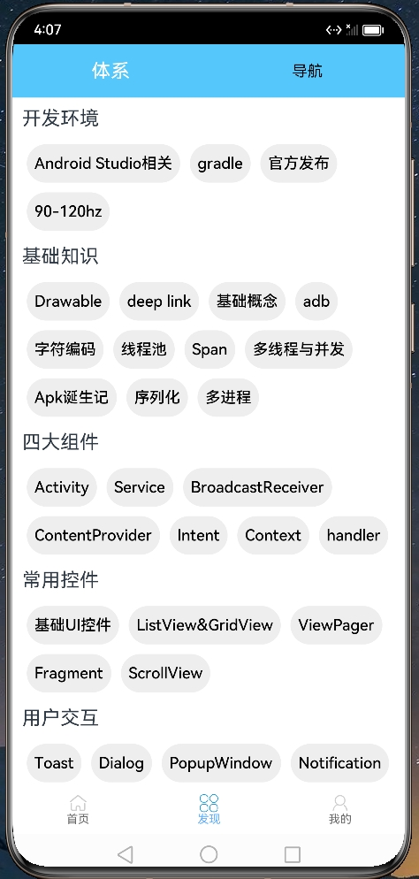
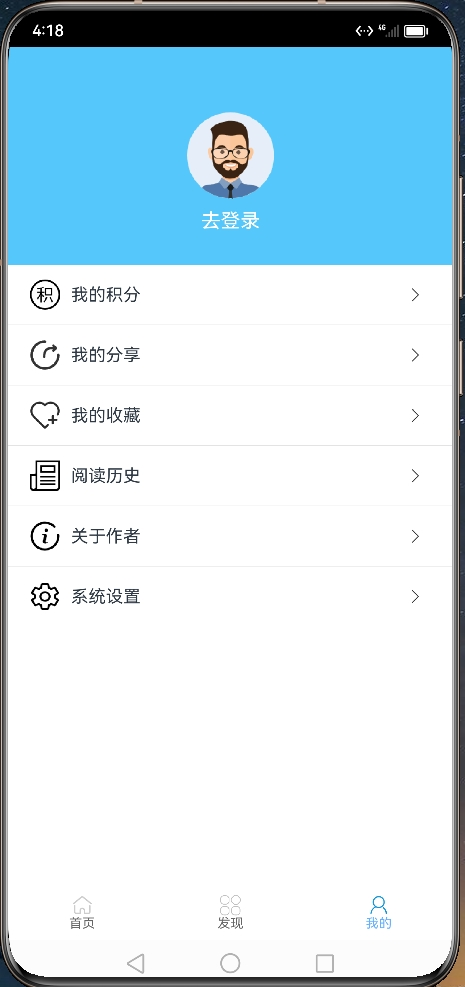
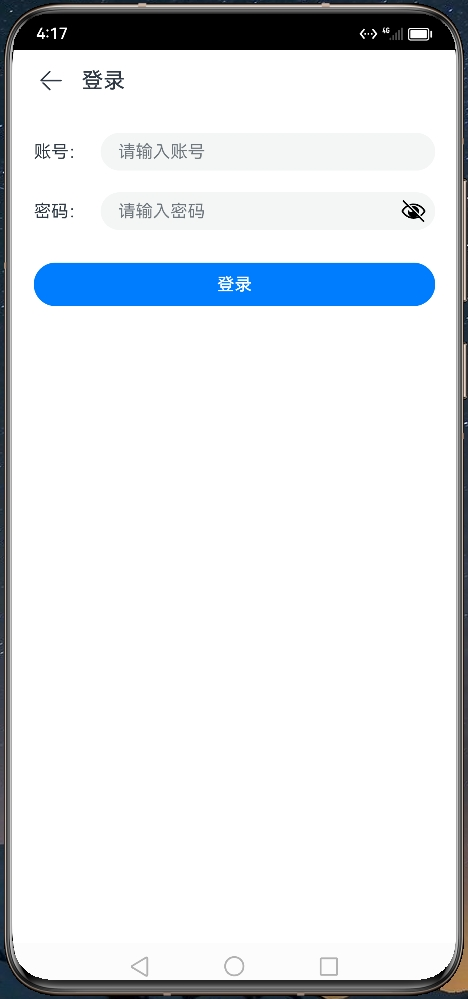
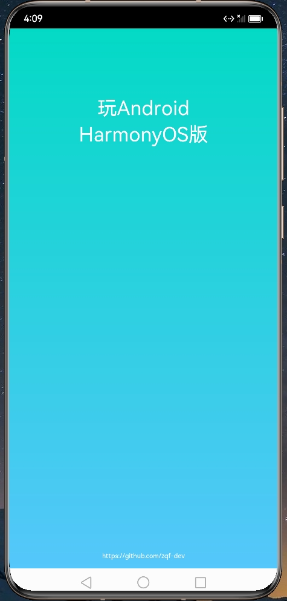

# WAndroidHOS
鸿蒙版本的玩Android，ArkTS版本、hap包、带注释等新手实战入门最佳助手，ArkTSUI框架、布局、权限、网络等实用技巧

## 项目介绍

​	项目使用DevEco Studio 3.1.1 Release，ArkTS API 9最新版本开发，都是ArkTS UI的组件，比较纯粹。主要是为巩固理论知识

借鉴了Android开发和前端的代码结构思路。照者技术文档一顿输出。拿之前开发过的**玩Android**写一个鸿蒙版本出来，涉及到UI的

布局、http网络请求数据、渲染数据、Banner广告、下拉刷新组件、Flex组件布局、数据保存、Web组件加载网页、JS调用等。

## 部分截图

|  |  |  |
| --------------------- | --------------------- | --------------------- |
|  |  |  |
|  |                       |                       |

## 更新日志

预计更新：

- web和JS之间交互；
- JS Bridge使用；
- Camera的使用；
- 完善我的等等部分二级页面；
- 临时增加一些功能；
- ...
- ...

v1.0.1 2024.01.06

此次更新优点仓促，中间由于工作和身体的原因耽搁了很多事情。后面会慢慢更新优化代码

- 下拉刷新上拉加载更多组件；
- 增加数据保存AppStorage、持久化Preferences使用；
- 完成发现页面UI增加流式布局
- 完善http网络请求
- 完成登录接口

v1.0.0 2023.11.26

- 完成我的页面UI

- 启动页的UI增加渐变用法

- 登录页面容器布局**Row**和**Column**细化用法

- 页面传值**@State**父子组件用法

- 增加**Web**组件页面加载使用

- 增加**Toast**的用法

- **Navigation**的用法

- 已反馈开放平台记录发现的bug：

  Text组件内使用Span子组件不能控制Span的visibility状态

  TextInput组件在外部改变ype的InputType.Password后会将text值清空

  

## 后续跟进计划

数据保存

web

Camera

音视频

数据库

...
