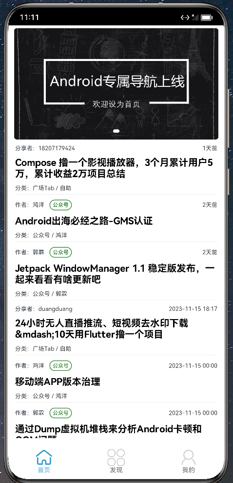
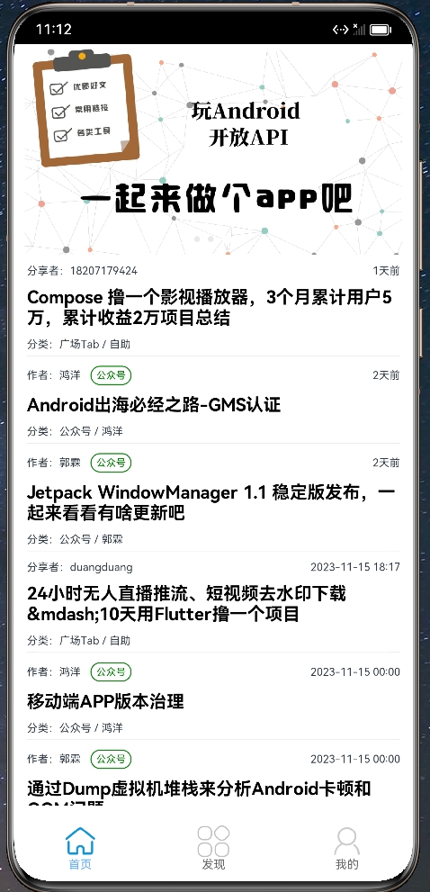

# WAndroidHOS
鸿蒙版本的玩Android，ArkTS版本、hap包、带注释等新手实战入门最佳助手，ArkTSUI框架、布局、权限、网络等实用技巧

## 项目介绍

​	项目使用DevEco Studio 3.1.1 Release，ArkTS API 9最新版本开发，都是ArkTS UI的组件，比较纯粹。主要是为巩固理论知识

借鉴了Android开发和前端的代码结构思路。照者技术文档一顿输出。拿之前开发过的**【玩Android】**写一个鸿蒙版本出来，涉及到UI的

布局、http网络请求数据、渲染数据、Banner广告、刷下组件、Flex组件布局、数据保存、Web组件加载网页、JS调用等

## 部分截图

|                         |                         |
| ----------------------- | ----------------------- |
|  |  |
|  | ----------------------- |

## 后续跟进计划

数据保存

web

Camera

音视频

数据库

...
